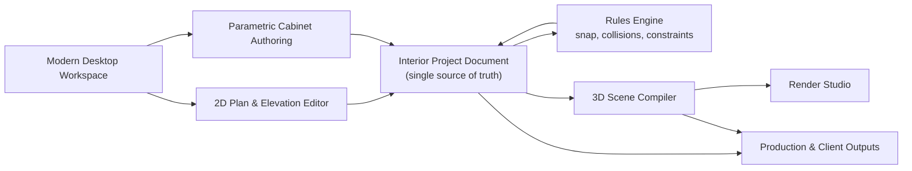

# Interior Design Tool — High-Level Design

## Product goal

A desktop, 2D-first interior and cabinet design tool for designers and workshops.

```text
Design in 2D → configure cabinetry visually → validate buildability
→ view synchronized 3D → render client image → export production package
```

The tool produces both client-facing presentation renders and workshop-facing plans, elevations, cutlists, hardware schedules, costing, and quotations.

## System overview



## Core workspace

```text
┌─────────────────────────────────────────────────────────────────────┐
│ Project / Save / Undo / Redo / Search / Render / Export             │
├───────────────┬────────────────────────────────────┬────────────────┤
│ Tool & Library│  2D Plan / Elevation / Section     │ Inspector      │
│               │                                    │                │
│ Rooms         │  Select • Move • Draw • Dimension  │ Cabinet type   │
│ Walls         │  Drag cabinets, snap and resize    │ W/H/D          │
│ Cabinets      │  Live dimensions and warnings      │ Doors/drawers  │
│ Doors         │                                    │ Materials      │
│ Appliances    │                                    │ Hardware       │
│ Materials     │                                    │ Construction   │
├───────────────┴────────────────────────────────────┴────────────────┤
│ Status: scale · units · snap · selected item · warnings             │
└─────────────────────────────────────────────────────────────────────┘
```

## Key domain modules

### 1. Project and room model

Rooms, walls, openings, floor/ceiling, dimensions, units, project versions, save/load, and undo/redo.

### 2. Cabinet system

Cabinet carcass, base/wall/tall units, wardrobes, TV units, display units, panels, fillers, countertops, doors, drawers, shelves, hardware, and material assignments.

### 3. Visual editing engine

Select, drag, rotate, resize, align, distribute, snap to wall/corner/module, and directly edit cabinet fronts in elevation.

### 4. Rules and validation

Minimum/maximum sizes, material thickness, door gaps, drawer clearances, appliance fitment, room bounds, wall-opening conflict, and manufacturing warnings.

### 5. Technical output engine

Floor plans, wall elevations, cabinet elevations, dimensions, cut lists, sheet optimization, hardware schedules, costing, quotes, and PDF/CSV export.

### 6. 3D and render engine

Converts the same parametric project into 3D geometry, applies materials, lights, and cameras, and exports polished PNG renders.

## First product scope: Wall Design Studio

Start with one polished workflow instead of every room type.

```text
Choose wall → draw/measure wall → place wardrobe or TV unit
→ configure cabinet doors/drawers/panels → choose materials
→ generate elevation + 3D render + cutlist
```

Initial module families:

- Wardrobes: hinged/sliding doors, loft units, handles, drawers, and internal shelves.
- TV walls: fluted panels, niches, drawers, display shelves, and LED lighting.
- Kitchens: added after the wall workflow is reliable.
- Partitions and bed backdrops: added next.

## Delivery phases

| Phase | Outcome |
| --- | --- |
| 1. Foundation | Modern shell, project model, room/wall editor, save/undo. |
| 2. 2D authoring | Cabinet placement, transforms, snapping, dimensions. |
| 3. Cabinet configurator | Doors, drawers, panels, materials, construction rules. |
| 4. Technical outputs | Plans, elevations, cutlists, costing, exports. |
| 5. Visualization | Live synchronized 3D, material/lighting/camera system. |
| 6. Render polish | Presentation renders and templates. |
| 7. Pilot hardening | Real designer projects, performance, UX, and production QA. |

## Recommended technology

- **Tauri + React + TypeScript** for the desktop app.
- **Canvas/SVG-based 2D workspace** for accurate editing and technical drawings.
- **Three.js / React Three Fiber** for live 3D and renders.
- **Parametric TypeScript domain model** for cabinet logic.
- **Local-first JSON project files** with explicit schema migrations.
- **Rust/Tauri commands** for filesystem access, native export, and later compute-heavy tasks.

## Guiding product principle

Build 2D and parametric cabinetry first. Rendering must be generated from the design model, not become a separate manual 3D modelling workflow.

### V1 scope boundary (Phase G)

- Millwork Design remains the cabinet-authoring surface on the synchronized 2D plan.
- The object library is curated and local; marketplace-scale browsing is deferred.
- Styleboards, Autostyler, and AI floor-plan recognition are not exposed in v1.
- Project load validates closed room graphs, bounds file input, and migrates legacy schemas before editing.
