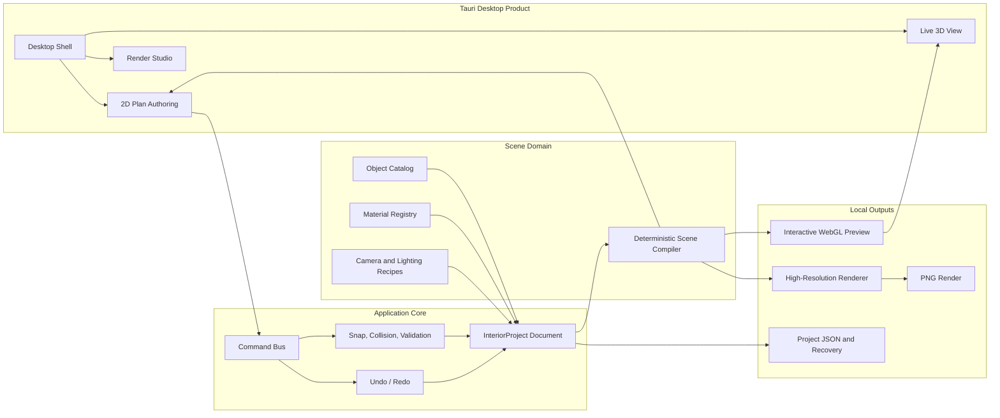
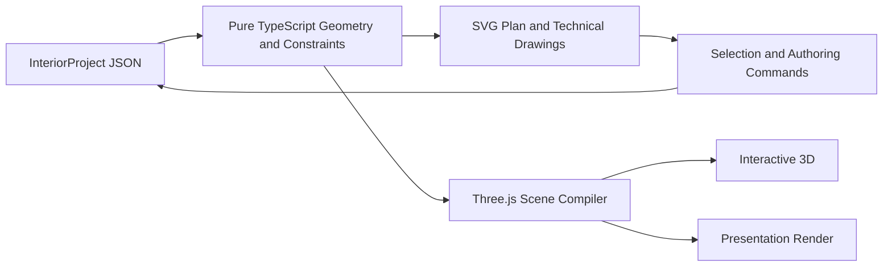

# Interior Cabinet Vision Go

Production-oriented desktop interior planning software built with Tauri, React,
TypeScript, and Three.js.

This branch defines and develops the **Living Room Visualizer MVP**: select a
2D living-room preset, author the layout in plan view, see the same project in
3D immediately, and export a polished presentation render.

> Planning document generated: **2026-08-11 21:42:01 IST**
>
> Working branch: **`codex/living-room-visualizer-mvp`**
>
> Baseline commit: **`733b3c6`** (`feat(runs): deepen wall-run authoring`)

## Product Statement

Build a professional desktop design application where a single, reusable
interior-project document drives 2D planning, synchronized 3D visualization,
cabinet engineering, presentation rendering, and production outputs.

The first focused experience is a living room. The underlying project format is
not living-room-specific; the same schema must support future bedrooms,
kitchens, offices, wardrobes, and custom spaces.

## MVP User Journey


## Principal Architecture



### Architectural Rule

`InteriorProject` is the only source of design truth. The 2D plan, interactive
3D viewport, final renderer, reports, and saved file must never maintain
independent copies of room or object geometry.

View-only state such as zoom, pan, open panels, current selection, and temporary
drag previews remains outside the saved design document.

## Universal Project Contract

Every entity has a stable ID. References use IDs, never array indexes. All
physical dimensions are stored in millimetres. Three.js converts millimetres to
metres only at the rendering boundary.

```ts
type InteriorProject = {
  schemaVersion: number;
  id: string;
  name: string;
  units: "mm";
  rooms: RoomEntity[];
  walls: WallEntity[];
  openings: OpeningEntity[];
  objects: InteriorObjectEntity[];
  materials: MaterialEntity[];
  lights: LightEntity[];
  cameras: CameraEntity[];
  activeRoomId: string;
  renderSettings: RenderSettings;
};

type InteriorObjectEntity = {
  id: string;
  roomId: string;
  kind: "cabinet" | "furniture" | "lighting" | "decor";
  category: string;
  catalogItemId: string;
  name: string;
  position: { x: number; y: number; z: number };
  rotation: { x: number; y: number; z: number };
  dimensions: { widthMm: number; heightMm: number; depthMm: number };
  materialSlots: Record<string, string>;
  parameters: Record<string, string | number | boolean>;
};
```

### Schema Requirements

- `schemaVersion` is mandatory and drives explicit migrations.
- Entity IDs remain stable through editing, saving, duplication, and migration.
- Openings reference `wallId`; objects and walls reference `roomId`.
- Derived lists such as room objects are selectors, not duplicated saved state.
- Cabinet objects retain their parametric cabinet configuration as typed payload.
- Furniture-specific values live in typed parameters without changing the core.
- Unknown catalog objects load as safe placeholders instead of crashing.
- Invalid numeric data is clamped and reported during document validation.

## Living Room MVP Scope

### Included

- One professionally composed rectangular living-room preset.
- Editable room width, depth, height, doors, and windows.
- Sofa, lounge chair, coffee table, side table, TV unit, rug, mirror, and lamp.
- 2D move, rotate, resize, duplicate, delete, align, and distribute operations.
- Wall, corner, centreline, grid, and neighbouring-object snapping.
- Collision, room-boundary, opening, door-swing, and circulation warnings.
- Immediate deterministic 2D-to-3D synchronization.
- Procedural material presets for wall paint, wood, fabric, metal, glass, and rug.
- Daylight, warm-evening, and neutral-studio lighting recipes.
- Wide-room, seating-area, and TV-wall camera presets.
- Draft, standard, and presentation render quality.
- Local project save, open, autosave, recovery, thumbnails, and PNG export.

### Deliberately Excluded

- Automatic interpretation of imported floor-plan images.
- SketchUp, DWG, DXF, BIM, or third-party model import.
- Cloud rendering, accounts, authentication, databases, or backend APIs.
- AI-generated room geometry or irreversible AI design changes.
- Claims of D5 Render-level path-traced photorealism.
- Arbitrary multi-floor architecture during this MVP.

## Rendering Strategy

The renderer has two modes that compile from the same scene:

| Mode | Purpose | Target |
| --- | --- | --- |
| Interactive | Editing and navigation | Responsive desktop frame rate |
| Presentation | Final image export | 1920x1080 or 2560x1440 PNG |

Presentation rendering uses physically based materials, sRGB output, ACES
filmic tone mapping, soft shadows, ambient occlusion, controlled exposure, and
purpose-built camera and lighting recipes. Geometry and materials remain local
and deterministic.

The MVP target is a strong catalogue-style interior image. More expensive
features such as path tracing, licensed model libraries, denoising, and HDRI
asset pipelines belong after the complete authoring workflow is proven.

## Delivery Milestones

### LR-01 - Universal Project Spine

**Status:** Complete (August 11, 2026)

Introduce the versioned `InteriorProject`, stable entity IDs, runtime
validation, migrations, cabinet compatibility selectors, and safe JSON
round-tripping.

**Exit gate:** Existing cabinet projects load and save without data loss, while
new generic room objects use the same document.

### LR-02 - Living Room Starter Contract

**Status:** Complete (August 11, 2026)

Create the living-room preset, generic object catalog entries, material slots,
openings, lights, and camera presets as deterministic project data.

**Exit gate:** Creating the preset repeatedly produces structurally identical
project documents apart from generated project/entity IDs.

### LR-03 - Plan-First Authoring

**Status:** Complete (August 11, 2026)

Deliver the complete 2D living-room workflow with direct manipulation,
dimensions, snapping, constraints, collision feedback, contextual commands,
and undo/redo.

**Exit gate:** A user can arrange the complete room accurately without opening
the 3D view.

### LR-04 - Deterministic Scene Compilation

**Status:** Complete (August 11, 2026)

Add object adapters, procedural geometry, material resolution, geometry caches,
safe placeholders, and synchronized selection/transforms between 2D and 3D.

**Exit gate:** Every accepted 2D command appears in 3D immediately and saved
projects compile to the same scene after reopening.

### LR-05 - Interior Style System

Build reusable material recipes, style presets, environment settings, light
rigs, exposure defaults, and render-safe colour management.

**Exit gate:** The preset looks intentionally designed in the interactive 3D
viewport without relying on external textures or models.

### LR-06 - Render Studio

Create a dedicated render workspace with camera thumbnails, quality presets,
lighting selection, exposure, output size, progress, cancellation, retry, image
comparison, and PNG export.

**Exit gate:** One action produces a polished presentation image from the exact
scene visible in the editor.

### LR-07 - Production Desktop Experience

Add a new-project wizard, preset previews, Plan/Model/Render workspaces,
autosave, recovery, recent projects, dirty-state feedback, thumbnails,
shortcuts, and useful empty/error states.

**Exit gate:** A first-time tester completes the journey without developer
assistance or knowledge of internal project structure.

### LR-08 - Release Candidate

Complete schema, migration, domain, interaction, rendering, recovery, and
performance tests. Verify macOS `.app` and `.dmg` packaging and provide a stable
demo project.

**Exit gate:** Preset -> 2D edit -> synchronized 3D -> render -> save -> reopen
passes end to end with no data or visual-state divergence.

## Production Quality Gates

- TypeScript compiles with no errors.
- Unit and domain tests pass before every milestone is accepted.
- Invalid project files fail safely and provide actionable errors.
- Every persistent schema change includes a migration and migration test.
- Undo/redo covers every accepted design mutation.
- Rendering never mutates project geometry or saved materials.
- Save and reopen produce equivalent project data and compiled scene bounds.
- The application remains usable without network connectivity.
- The desktop shell has no document-level scrolling or clipped primary tools.
- Build output remains split into maintainable production chunks.

## Target Source Boundaries

```text
src/
  application/       commands, history, selection, project sessions
  components/        desktop shell and React workspaces
  domain/
    interiorProject/ schema, validation, migrations, selectors
    roomLayout/      walls, openings, constraints, spatial rules
    objectCatalog/   furniture and cabinet definitions
    sceneCompiler/   deterministic render-node compilation
    materials/       material entities and procedural recipes
    rendering/       cameras, lighting, quality and export contracts
  platform/          Tauri file, dialog, recovery and image adapters
  styles/            product tokens and workspace-specific CSS
```

Domain modules must not import React, React Three Fiber, Three.js, Tauri, or DOM
APIs. Platform and rendering adapters consume domain output, not the reverse.

## Tooling and Stack Contract

This stack is the committed foundation for the Living Room Visualizer MVP. It
should continue after the MVP unless a measured product requirement proves that
one layer must be extended. New tools must fit behind the boundaries below
rather than replacing the project document or duplicating geometry state.

| Area | Tool | Responsibility |
| --- | --- | --- |
| Desktop runtime | Tauri 2 and Rust | Native application packaging, OS integration, filesystem access, and dialogs |
| Interface | React 19 | Desktop shell, plan workspace, inspectors, 3D viewport, and Render Studio |
| Application language | TypeScript 5 | Project schema, geometry, commands, validation, and application logic |
| Interface styling | CSS | Purpose-built professional desktop UI without a component framework |
| Build tooling | Vite 6 | Development server, production bundling, and chunk splitting |
| 2D authoring | SVG and React | Plans, elevations, dimensions, labels, grips, and snapping guides |
| Spatial rules | Pure TypeScript | Walls, openings, footprints, snapping, intersections, and collision checks |
| 3D engine | Three.js | Geometry, materials, lights, cameras, shadows, and WebGL rendering |
| React 3D integration | `@react-three/fiber` | Declarative Three.js scene integration with React |
| 3D utilities | `@react-three/drei` | Orbit controls and selected scene helpers |
| Project persistence | Versioned JSON | Portable, local, reusable `InteriorProject` document |
| Native persistence | Tauri dialog and filesystem plugins | Save, open, autosave, recovery, and image output |
| PDF output | jsPDF | Technical sheets, reports, and project documents |
| Unit testing | Vitest | Domain, geometry, validation, migration, and compiler tests |
| End-to-end testing | Playwright, introduced during the MVP | Browser-surface Plan-to-Model-to-Render workflow testing |
| Source and delivery | Git and GitHub | Branching, review, releases, and the web demonstration build |

### CAD Approach

The MVP does not use AutoCAD, OpenCASCADE, a CAD kernel, or a second geometry
runtime. Its CAD-style authoring pipeline is:



Pure domain modules calculate walls, openings, footprints, measurements,
dimensions, clearances, collision rules, parametric objects, and coordinate
conversion. SVG is the 2D authoring surface because it provides crisp vector
lines, selectable objects, printable output, and direct pointer interaction.

Three.js is a visualization and rendering adapter. It must not become the
source of room dimensions, object placement, or material assignments.

### Rendering Tools

The MVP uses the Three.js `WebGLRenderer` for both interactive preview and
high-resolution image generation. The presentation pipeline will use:

- `MeshStandardMaterial` and `MeshPhysicalMaterial`.
- sRGB output and ACES filmic tone mapping.
- Controlled exposure and physically credible roughness and metalness.
- Directional, ambient, spot, and area-light recipes.
- Soft shadows, ambient occlusion, and antialiasing.
- Procedural wood, fabric, floor, wall, metal, glass, and rug appearance.
- Camera recipes and offscreen 1920x1080 or 2560x1440 PNG rendering.

Rendering must be accessed through a `RenderEngine` application contract. A
future WebGPU, path-tracing, native, or cloud renderer can implement that
contract without changing `InteriorProject` or the 2D authoring workflow.

### State and Data

Redux and a database are not required for this MVP.

- React hooks own temporary interface state such as open panels and viewport zoom.
- The command system owns persistent project mutations and undo/redo history.
- `InteriorProject` remains the only saved design state.
- Domain selectors derive room objects, cabinet lists, scene nodes, and reports.
- Tauri writes project JSON, recovery snapshots, thumbnails, and exported images.
- No feature may maintain separate editable copies of the 2D and 3D layout.

### Furniture and Asset Strategy

The MVP uses procedural, parametric furniture and locally generated material
appearance. This keeps the first release deterministic, offline, legally safe,
and compatible with the original no-external-model requirement.

After the MVP proves the complete workflow, the asset layer may add:

- Blender as an offline model-authoring and optimization tool.
- Local glTF or GLB furniture assets.
- Draco-compressed geometry.
- KTX2-compressed PBR textures.
- Licensed and versioned local asset packs.

Blender and asset converters are build-time tools, not application runtime
dependencies. Catalog IDs and material-slot IDs remain stable whether an object
uses procedural geometry or a future GLB asset.

### Post-MVP Extension Points

| Future requirement | Extension approach |
| --- | --- |
| DXF or DWG exchange | Add import/export adapters around domain entities |
| SketchUp content | Convert or import into catalog objects without changing project structure |
| Higher-end rendering | Implement another `RenderEngine` adapter |
| Cloud collaboration | Add a repository/synchronization adapter around project JSON |
| Advanced manufacturing | Add machining, optimization, and machine-export domain modules |
| Photorealistic libraries | Add a controlled local GLB and PBR asset pipeline |

No post-MVP adapter may make a proprietary file format, rendering engine, or
cloud service the source of project truth.

### Tools Intentionally Excluded

- Electron.
- Unity or Unreal Engine.
- Redux for project state.
- Backend APIs, databases, authentication, or cloud services during the MVP.
- OpenCASCADE or another CAD kernel.
- Third-party UI component libraries.
- Runtime dependence on Blender.
- Unlicensed external textures or furniture models.

### Stack Decision

```text
Tauri + React + TypeScript
SVG for 2D CAD-style authoring
Pure TypeScript for geometry and spatial rules
Three.js + React Three Fiber for synchronized 3D
Three.js WebGL for MVP presentation rendering
Versioned InteriorProject JSON as the source of truth
Vitest + Playwright for quality assurance
Local-first filesystem persistence
```

This combination is sufficient for a production-quality living-room MVP and
keeps clear upgrade paths for future rooms, cabinet engineering, richer assets,
renderers, exchange formats, and manufacturing workflows.

## Development

Install dependencies:

```bash
npm install
```

Run the web development surface:

```bash
npm run dev
```

Run the macOS desktop application:

```bash
npm run tauri dev
```

Run all tests:

```bash
npm test
```

Build the production frontend:

```bash
npm run build
```

Build the macOS application bundle and installer:

```bash
npm run tauri build
```

Tauri output is generated under `src-tauri/target/release/bundle/`, including
the `.app` and `.dmg` artifacts when macOS bundling succeeds.

## Definition of MVP Complete

The Living Room Visualizer MVP is complete only when a new tester can:

1. Create a project from the living-room preset.
2. Modify the room and arrange furniture entirely in 2D.
3. See the same layout immediately and accurately in 3D.
4. Apply a style, lighting recipe, and camera preset.
5. Export a polished high-resolution PNG.
6. Save, close, reopen, and recover the same editable project.
7. Complete the workflow without network access or developer intervention.

Until all seven statements are true, the branch remains an active MVP branch
and should not be presented as a production release.
