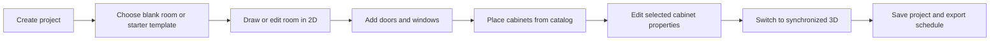

# Phase 0 — Unified Planner MVP Definition

**Status:** Approved planning baseline — no feature implementation in this phase.

## 1. Product decision

The next product is a **simple room and cabinet planner**, not a collection of separate 2D, 3D, rendering, and cabinet applications.

One project model drives every view:

```text
Project → 2D plan ↔ 3D model → presentation output → workshop output
```

The existing Living Room Visualizer remains a usable vertical slice and a source of reusable room, catalog, material, camera, rendering, and persistence capabilities. The next work makes that capability discoverable through a simpler planner workspace and extends it toward cabinet-led projects.

## 2. First user and job

| Item | Decision |
| --- | --- |
| Primary user | Interior designer or cabinet-shop designer preparing a room concept for a client. |
| Primary job | Turn a measured or imported room plan into an editable cabinet-and-interior layout, then inspect it in 3D. |
| First success | The user creates one room, adds an opening and cabinet modules, switches between 2D and 3D, saves the project, and exports a cabinet schedule. |
| Primary device | Desktop; wide-screen, mouse-first workflow. |
| Units | Millimetres in stored data; displayed units are selectable later. |

## 3. MVP user journey



The render workflow is intentionally **not required** for this first planner MVP. Existing render functionality stays available behind the Render mode, but it must not slow the editor foundation.

## 4. Simple interface contract

The UI has four top-level modes only:

```text
[ Project ] [ Build ] [ Design ] [ Render ]
```

| Area | Responsibility | MVP rule |
| --- | --- | --- |
| Project | New, template, plan upload, save/open/export | No hidden project setup flow. |
| Build | Rooms, walls, doors, windows, dimensions | 2D is the authoring source for room structure. |
| Design | Cabinets, furniture, materials, layers | Catalog placement and selected-item editing live here. |
| Render | 2D/3D presentation views, camera, export | Keep the interface secondary until Build and Design are reliable. |
| Centre canvas | The active 2D or 3D representation | One clear 2D/3D switch; never duplicate project state. |
| Left rail | Current mode's small set of tools | Maximum five primary tools visible at once. |
| Right inspector | Only the currently selected room, wall, opening, or object | Contextual; no permanent configuration dump. |

### MVP shell

```text
┌─────────────────────────────────────────────────────────────────┐
│ Project name · Undo · Redo · [ 2D | 3D ] · Save · Export        │
├──────────────┬──────────────────────────────────┬───────────────┤
│ Tool rail    │ Main canvas                      │ Inspector     │
│ Build        │ 2D plan or 3D model              │ Selected item │
│ Cabinets     │                                  │ dimensions    │
│ Furniture    │                                  │ materials     │
│ Materials    │                                  │ actions       │
│ Layers       │                                  │               │
├──────────────┴──────────────────────────────────┴───────────────┤
│ Grid · snap · units · zoom · validation status                   │
└─────────────────────────────────────────────────────────────────┘
```

## 5. Capability boundary

### Included

- Create a blank rectangular room or choose a room starter.
- Import a PNG, JPG, or WebP floor-plan image as a scaleable tracing underlay.
- Draw and modify a room footprint, walls, and room dimensions in 2D.
- Add and edit doors and windows.
- Place, select, move, rotate, resize, duplicate, and delete cabinet modules.
- Snap cabinet modules to walls, corners, and adjacent modules.
- Edit essential cabinet properties: width, height, depth, finish, and opening configuration where supported.
- Switch between synchronized 2D and 3D views.
- Save/open locally, undo/redo, recover autosaves, and export a cabinet/millwork schedule.

### Explicitly deferred

- Automatic AI interpretation of a floor-plan image.
- Multi-floor buildings, roof tools, terrain, and exterior design.
- A large marketplace or vendor catalog.
- Collaborative editing, accounts, cloud sync, and client portals.
- Photorealistic or cloud rendering as a release gate.
- Full kitchen, bedroom, and whole-home workflows.
- CNC/MES workflows beyond the existing schedule/cut-list integrations.

## 6. Product data rules

These rules are non-negotiable and build on the existing `InteriorProject` contract.

1. `InteriorProject` remains the one saved source of truth.
2. 2D plan, 3D scene, render, and schedule are derived from the same room, opening, cabinet, object, and material entities.
3. Project dimensions are stored in millimetres with stable IDs and versioned schema migrations.
4. Selection, open panels, zoom, drag previews, and camera navigation are UI state, not design data.
5. Every user-visible edit is undoable and survives save/open unchanged.
6. Three.js never becomes the authoring source for geometry or cabinet dimensions.

## 7. Acceptance criteria

Phase 0 is complete when the following decisions are accepted as the build contract:

- [x] The first user and first job are named.
- [x] The MVP journey is limited to one room and a cabinet-led layout.
- [x] The shell is limited to Project, Build, Design, and Render modes.
- [x] The 2D/3D switch is defined as two views of one model.
- [x] The included and deferred capabilities are explicit.
- [x] The existing Living Room Visualizer is identified as reusable foundation work.
- [x] The implementation sequence is agreed: shell → 2D build → cabinet design → synchronized 3D → outputs → render enhancements.

## 8. Handoff to implementation

| Next phase | Outcome | Exit check |
| --- | --- | --- |
| Phase 1 — Planner shell | The simple navigation, tool rail, canvas, inspector, and 2D/3D switch exist as a consistent workspace. | A tester can identify the current mode and selected object without instruction. |
| Phase 2 — Build in 2D | A user creates or edits the physical room structure. | A saved plan round-trips walls, dimensions, doors, and windows. |
| Phase 3 — Cabinet design | A user places and configures cabinet modules against walls. | Cabinet transforms, snapping, and essential properties are predictable and undoable. |
| Phase 4 — One model, two views | The same 2D model produces a correctly aligned 3D room. | A change made in 2D appears in 3D immediately and after reload. |
| Phase 5 — Outputs | The layout produces a trustworthy schedule and technical output. | Export values match placed cabinets and stored millimetres. |
| Phase 6 — Render | Existing rendering is simplified and made presentation-ready. | Rendering has no separate editable geometry state. |

## 9. Open decisions before Phase 1

These choices affect detailed UI and implementation, so they need owner approval before coding starts:

1. Is the first cabinet-led template a **wardrobe wall**, **TV wall**, or **small kitchen run**?
2. Is imported-plan tracing essential in the first public planner release or a Phase 2 addition?
3. Should the first release display only millimetres, or offer feet/inches immediately?
4. Should “Furniture” be available in the first left rail, or should the first workflow focus only on cabinets and openings?

