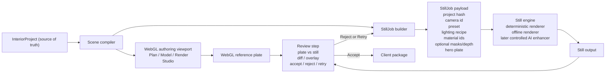

# Phase 2 — Hybrid Stills Pipeline

**Status:** Implemented (Phase 2A–C) · proof gate: `npm run phase2:proof`  
**Product spine:** Plan → Model → Render (unchanged)  
**Goal:** Add a **trusted stills presentation pipeline** on top of the authored scene, without turning the product into a stills-first renderer.

**Related docs:** [Phase 1 — WebGL Presentation Floor](./PHASE_1_WEBGL_PRESENTATION_FLOOR.md) · [StillJob trust contract](./STILLJOB_TRUST_CONTRACT.md) · [Product decisions](./PRODUCT_DECISIONS.md)

---

## 0. Why this phase exists

Phase 1 raised the **WebGL presentation floor**:

- Draft vs Client Preview became visibly different
- lighting, grounding, materials, and framing improved
- proof automation + benchmark fixtures now exist

That work was necessary, but it does **not** solve the next ceiling:

> Client-facing still quality is still bounded by the realtime WebGL path.

Phase 2 exists to raise the **presentation ceiling** while preserving the authored project as truth.

This is **not** a pivot away from the product. The product remains:

> **Cabinet-aware interior authoring** for a custom cabinet shop salesperson / designer producing revisable living-room concept previews from manufacturable layouts.

Phase 2 adds a better presentation layer; it does not replace the core authoring loop.

---

## 1. Phase 2 in one sentence

**Generate higher-quality stills from the authored scene through a separate `StillJob` pipeline, then only allow accepted stills into the client package.**

---

## 2. Product rule we keep

`InteriorProject` remains the only editable source of truth.

That means:

- Plan / Model editing still happens against `InteriorProject`
- WebGL viewport remains the authoritative interactive representation
- still output is a **presentation artifact**
- still output never silently rewrites authored project data

If Phase 2 breaks that rule, it is the wrong architecture.

---

## 3. What Phase 2 is / is not

| Phase 2 **is** | Phase 2 **is not** |
|---|---|
| Separate stills presentation pipeline | Rebuild as a stills-first product |
| `StillJob` request built from authored truth | Second editable scene format |
| Review/accept workflow before package inclusion | Auto-shipping pretty but unverified stills |
| Deterministic or controlled enhancement engine | “Prompt and pray” AI rendering |
| Better client presentation output | Replacing the authoring viewport |

**Hard constraints:**

- `InteriorProject` stays JSON-safe and editable truth
- `StillJob` references project truth; it does not embed GPU/runtime objects
- accepted stills may enter the client package; rejected stills may not
- still provenance must be recorded in a manifest
- trust rules in `docs/STILLJOB_TRUST_CONTRACT.md` are product law

---

## 4. Target pipeline

---

## 5. Architecture rules

### 5.1 Truth separation

- `InteriorProject` = editable truth
- WebGL Client Preview = authoritative interactive scene view
- `StillJob` = request for presentation enhancement
- still output = client-facing still, labeled as such

### 5.2 No edit-back illusion

Users do **not** edit geometry through a still.

If the still reveals a design issue, the user must edit:

`Plan / Model -> re-run StillJob`

There is no “paint out the sofa and pretend the project changed.”

### 5.3 Review before ship

A still is not trusted just because it is attractive.

Before package inclusion, the user must be able to inspect:

- WebGL reference plate
- still output
- simple diff / overlay / mask view

### 5.4 Provenance

Every still included in a client package must record:

- `projectId`
- project content hash / snapshot id
- `schemaVersion`
- `cameraId`
- engine id + version
- seed if stochastic
- allowed enhancement flags
- acceptance status / accepted-at metadata

---

## 6. StillJob contract (what gets built)

The Phase 2 request artifact should be `StillJob`.

Required fields:

- `projectId`
- `projectHash`
- `schemaVersion`
- `cameraId`
- locked camera pose
- presentation preset id / quality id
- lighting recipe id / style ids
- engine id / version
- seed when stochastic
- allowed enhancement flags

Optional deterministic support artifacts:

- hero PNG plate
- depth map
- normal map
- segmentation / material id map

The detailed fidelity rules remain in [STILLJOB_TRUST_CONTRACT.md](./STILLJOB_TRUST_CONTRACT.md).

---

## 7. Recommended implementation order

### Phase 2A — Still foundation

**Goal:** prove handoff from authored truth to still request cleanly.

Build:

- stable `StillJob` creation from a locked project snapshot
- deterministic support export: hero plate, camera pose, material ids, optional masks
- manifest/provenance shape
- validation against contract/tolerances

**Done when:**

- one authored room/camera can produce a valid `StillJob`
- the job can be revalidated from saved artifacts
- no project truth is mutated during still generation

### Phase 2B — Review workflow

**Goal:** make still acceptance a product behavior, not a manual convention.

Build:

- Generate Still action in Render Studio
- comparison view:
  `WebGL plate | still | diff/overlay`
- actions:
  `Accept`, `Reject`, `Retry`
- package manifest recording accepted still provenance

**Done when:**

- no still can enter the package without explicit acceptance
- rejected stills leave the authored project unchanged

### Phase 2C — First still engine

**Goal:** plug in the first controllable enhancement engine.

Start with the most controllable option available:

- deterministic renderer if feasible
- controlled offline renderer
- only then controlled AI enhancement if the product explicitly opens it

**Done when:**

- still outputs are visibly stronger than WebGL export
- trust contract checks still hold
- retry/regenerate behavior is understandable to the user

---

## 8. Phase 2 module map

### Domain

| Module | Path | Phase 2 job |
|---|---|---|
| StillJob core | `src/domain/livingRoom/stillJob/` | Expand request/validation/provenance types |
| Trust rules | `docs/STILLJOB_TRUST_CONTRACT.md` + domain validators | Keep fidelity law executable |
| Review state | `src/domain/livingRoom/stillReview/` | Accept/reject/retry state machine |
| Manifest | `src/domain/livingRoom/clientPresentation/` | Record accepted still provenance in package |

### Rendering / export

| Module | Path | Phase 2 job |
|---|---|---|
| Hero plate export | `src/rendering/export/` | Deterministic plate + support artifacts |
| Material id / masks | `src/rendering/materials/` + export helpers | Provide still engine control inputs |
| Capture bridge | `src/components/livingRoomScene/RenderCaptureBridge.tsx` | Export support data without mutating truth |

### UI

| Module | Path | Phase 2 job |
|---|---|---|
| Render Studio | `src/components/LivingRoomRenderStudio.tsx` | Trigger StillJob and host review flow |
| Review panel | `src/components/livingRoomScene/` | Plate/still/diff comparison + accept/reject |
| Diagnostics | `src/components/livingRoomScene/RenderDiagnosticsPanel.tsx` | Surface still provenance / trust flags |

### Fixtures / proof

| Piece | Path | Phase 2 job |
|---|---|---|
| Benchmark rooms | `fixtures/phase-1-benchmarks/` | Reuse locked rooms/cameras for still QA |
| Still spike fixtures | `fixtures/still-job-spike/` | Grow handoff spike into real fixtures |
| Future proof pack | `fixtures/phase-2-stills/` | Capture still QA artifacts once Phase 2 begins |

---

## 9. Acceptance criteria

Phase 2 is complete only when all of these are true:

- a locked authored camera can produce a valid `StillJob`
- still generation does not mutate `InteriorProject`
- review UI shows plate vs still vs diff/overlay
- only accepted stills enter the client package
- provenance manifest is written with engine/version/seed/project hash/camera id
- trust contract mismatches fail QA
- authored truth remains editable after any still accept/reject/retry cycle

---

## 10. What not to do

- do not reopen endless WebGL polishing as a substitute for a still pipeline
- do not turn the product into a generic AI room rendering app
- do not let still output become editable truth
- do not ship “premium stills” UX before review and provenance exist
- do not start with full path-tracer complexity unless product explicitly chooses that cost

---

## 11. Parallel product track

Phase 2 should run alongside the named workshop-side credibility deliverable:

> **Living-room Millwork Schedule v1**

See [MILLWORK_SCHEDULE_V1.md](./MILLWORK_SCHEDULE_V1.md) for the slice now in development (schedule export + Model W×H×D / materials inspector).

Why:

- still quality improves presentation
- millwork schedule keeps the **cabinet-aware** wedge real

Without the workshop-side follow-through, the product risks drifting toward “nice room viz” instead of “cabinet-aware interior authoring.”

---

## 12. Suggested next 2–4 weeks

| Week | Focus |
|---|---|
| 1 | Promote current StillJob spike into real request/validation/provenance types |
| 2 | Export deterministic support artifacts: hero plate, camera pose, material ids, optional masks |
| 3 | Add review flow in Render Studio: Generate Still, diff/overlay, Accept/Reject/Retry |
| 4 | Integrate first controlled still engine behind the trust contract, then QA on locked benchmark rooms |

---

## 13. One-line Phase 2 pitch

**Keep the authored cabinet-aware scene as truth, then generate stronger client stills through a separate reviewed pipeline that is allowed to look better but not allowed to lie.**
