# Cabinet Studio UI workflow redesign

Status: design direction accepted; build steps 1–8 complete on
`codex/feat/ui-workflow-redesign` (September 2026). Treat as **UI workflow
complete**, not “redesign finished.” 2D Room appearance approved as **A — Light
drafting studio** (chrome/layout only; functionality unchanged); refinement
still blocks implementation. Open design and product tracks:
[ui-workflow-FOLLOW_UPS.md](ui-workflow-FOLLOW_UPS.md) (2D Room reference,
commercial dialogs, dual chrome, Report Center, shortcuts). Production release
and Product Book replacement are separate.

## New 2D visual proposal — appearance approved (10 September 2026)

The latest live screenshot still shows a dark, hard-to-read plan and stacked
selection, measurement, print and run controls. A follow-up proposal compared a
light drafting studio with a dark frame around a bright canvas. This is **not**
a replacement for completed steps 1–8 and does **not** change product
functionality.

**Appearance decision (approved):** default to **A — Light drafting studio**.
Keep **B — Dark frame / bright canvas** as an optional chrome theme (plan surface
stays light either way). Accept a bright 2D canvas with stronger linework and a
quieter grid; one compact plan toolbar; layers/print options in expandable
settings; contextual room essentials and on-demand libraries.

**Functionality preservation (non-negotiable):** this approval is chrome and
layout only. Existing domain commands stay reachable — including perspective /
Orbit / Walkthrough and other camera tools, draw/measure/snap, underlay, runs,
materials, undo/redo, imports, exports, cutaways, review/quote gates, Present,
and engineering outputs. Handlers, geometry, costing and manufacturing math are
unchanged. Relocate entry points only after each replacement is verified; keep
the old control until then.

**Chrome landed (plan workspace only):** an open job uses `is-drafting-studio`
— light tokens, bright plan, compact toolbar, Layers / Export sheet on demand.
Projects home is unchanged. Domain commands stay on existing handlers. The
follow-up implementation now includes explicit zoom buttons, the live actionable
issue footer, contextual inspector frames, and responsive inspector reflow. See the
[2D screenshot walkthrough](mockups/interiors-2d-review/README.md) and
[follow-ups](ui-workflow-FOLLOW_UPS.md).

### Recommendation closure — 10 September 2026

The implementation pass on `codex/feat/animated-3d-showroom` closes the concrete
review findings without changing geometry, costing, serialization, or production
commands:

- Layers and Export sheet panels anchor to the complete title bar, stay inside
  the viewport, scroll internally, and close their sibling sheet when opened.
- Measure and calibration are promoted into the compact primary plan bar. Room,
  architecture, underlay, and site-measure settings use one expandable secondary
  section instead of occupying a permanent row.
- Plan zoom-out, zoom-in, Fit, Fit selection, grid, snap, layers, and export have
  visible entry points. Existing wheel zoom and pan gestures remain available.
- Below 960 px the inspector enters normal document flow under the canvas rather
  than covering the drawing. The toolbar wraps and the canvas retains a usable
  minimum height.
- Catalog content now has its own bounded scrolling region. The selected-object
  inspector hides the room object list while an item is active, shows a single
  compact identity card, keeps technical catalogue IDs on demand, and uses
  responsive action, dimension, and material grids.
- File → Canvas appearance offers **Light studio** and **Dark frame**. Both keep
  the drafting surface light and store the choice locally.
- Editable shortcut bindings now drive Interiors undo, redo, duplicate, delete,
  rotate, plan/3D switching, and Fit actions. Legacy plain `1` / `2` plan switching
  and `Cmd/Ctrl+0` Fit remain available for continuity.
- Review shows a compact readiness summary and progressive Plan/model, Client/job,
  and Quote/approval sections. Existing proposal and gate handlers are reused.
- 3D render diagnostics move behind a Scene health disclosure and remain absent
  from Present. Camera, cutaway, materials, mechanisms, and style palette behavior
  is unchanged.

The remaining 3D quality limit is asset fidelity: procedural fallbacks and current
catalog geometry cannot become presentation-grade furniture through shell CSS.
Replacing those models, UVs, textures, and lighting assets remains a separate asset
production track with render QA. Mobile layouts remain a practical reflow for
review and emergency edits, not a promise of full phone CAD authoring.

Walkthrough: 11 captures cover both appearances, expanded room / opening /
underlay / run settings, layers, export and branding, materials, wall drawing
and measurement. The [interactive copy](mockups/interiors-2d-review/index.html)
is retained locally with its sandbox and CSP.

### 1. A — Light drafting studio: header and toolbar

**Approved default.** Light controls, unnumbered area navigation and a single drawing toolbar. The next capture continues below this view.

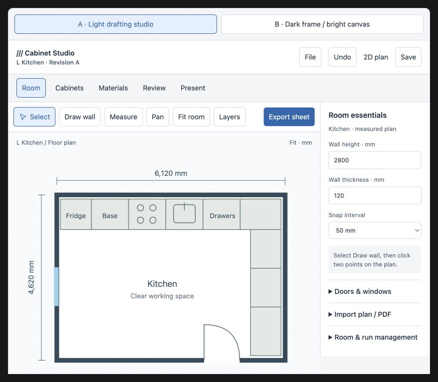

### 2. A — Complete plan and footer

The entire room boundary, opening, dimensions and footer are visible. A bright canvas and simplified symbols make the plan easier to read.

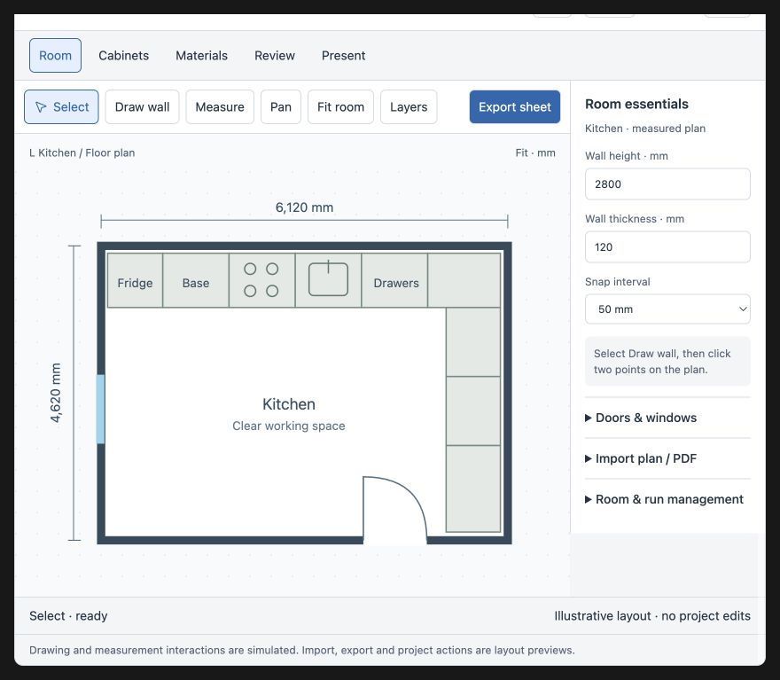

### 3. Room settings expanded

Room essentials remain above Doors & windows, Import plan / PDF and Room & run management. The following capture shows the lower controls in full.

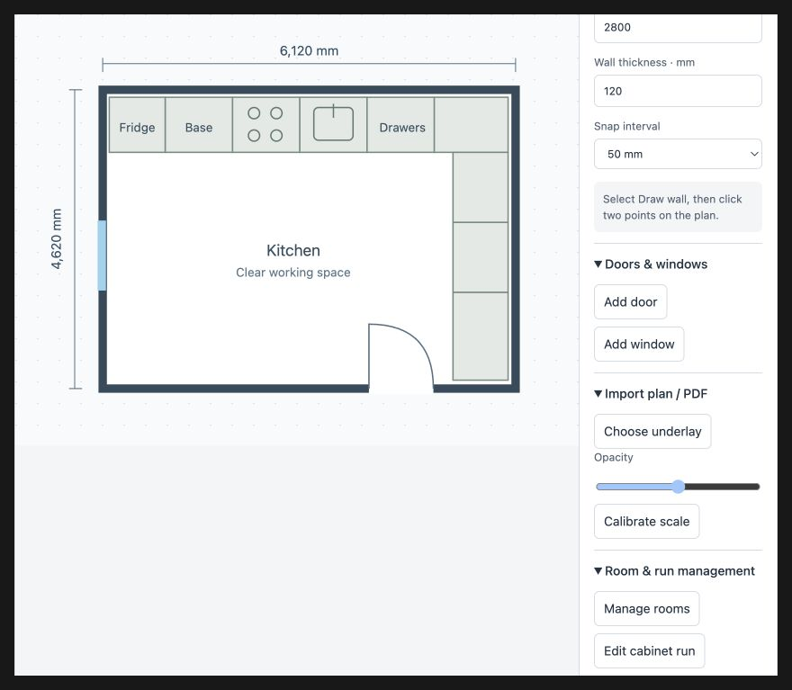

### 4. Openings, underlay and runs — lower detail

Add door/window, Choose underlay, opacity, Calibrate scale, Manage rooms and Edit cabinet run are visible. These are proposed entry points; the dialogs are not implemented in this mockup.

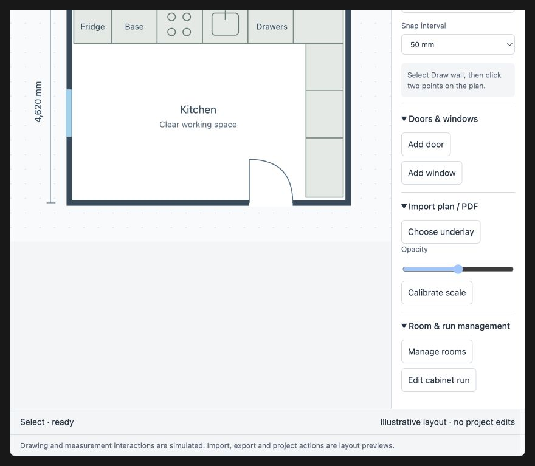

### 5. Plan layers

Cabinets, Dimensions, Labels and Grid move out of the permanent top bars into an expandable section.

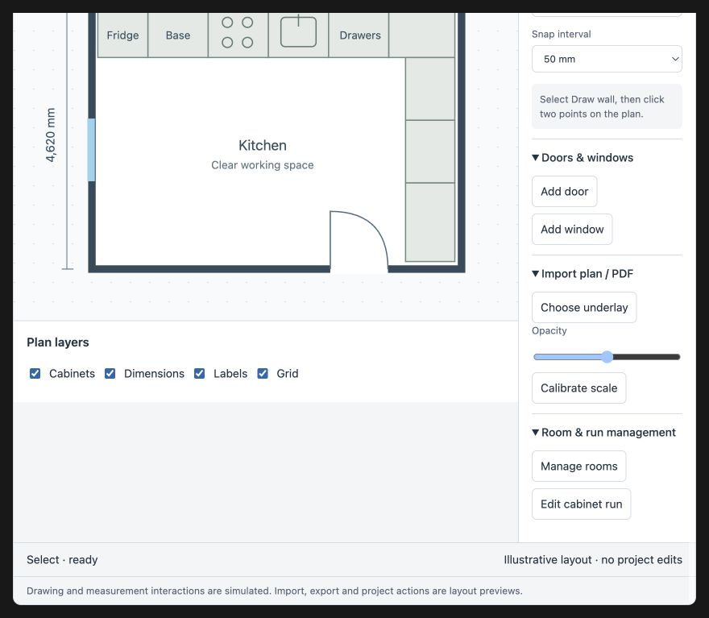

### 6. Export sheet and branding expanded

Drawing style, paper size, PDF/PNG choice, company name, drawing title and revision are shown together. This previews settings only; it does not generate an export.

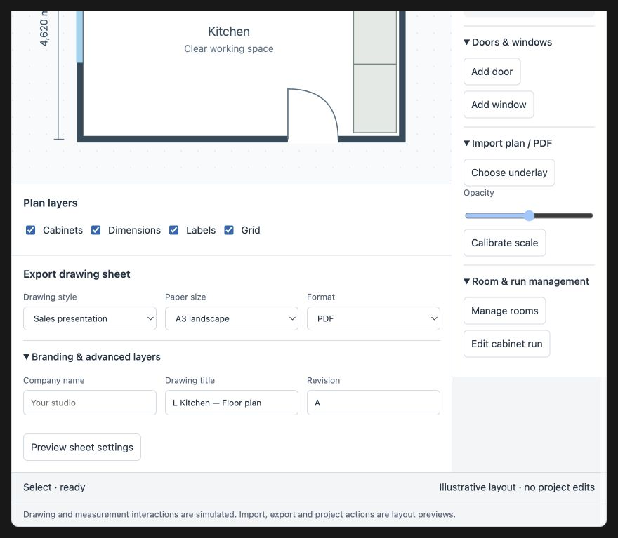

### 7. B — Dark frame: header and toolbar

**Optional chrome theme** (not the default). Dark chrome retains readable controls and the same navigation. The drawing surface remains light.

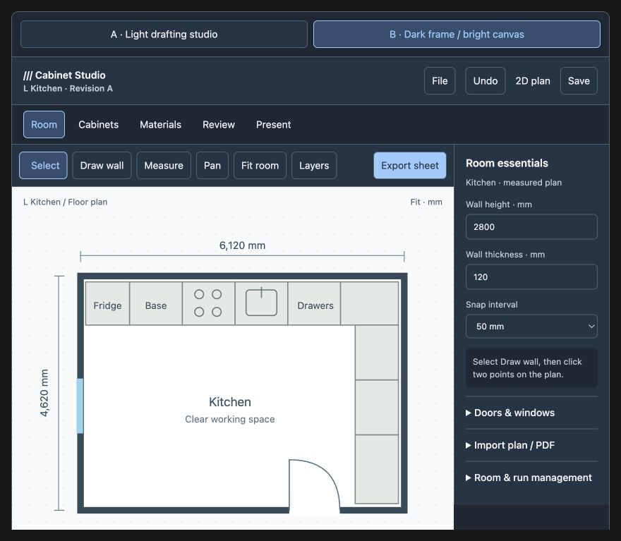

### 8. B — Bright plan inside dark chrome

Complete plan and footer in the alternative theme. Changing chrome does not require changing plan colors.

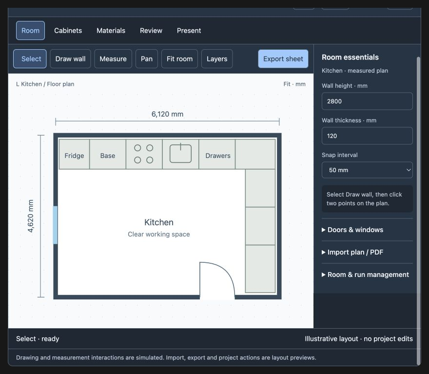

### 9. Materials inspector

Soft sage, Natural oak and Chalk white demonstrate visible cabinet fills. These are illustrative choices, not the production material catalogue or application-scope design.

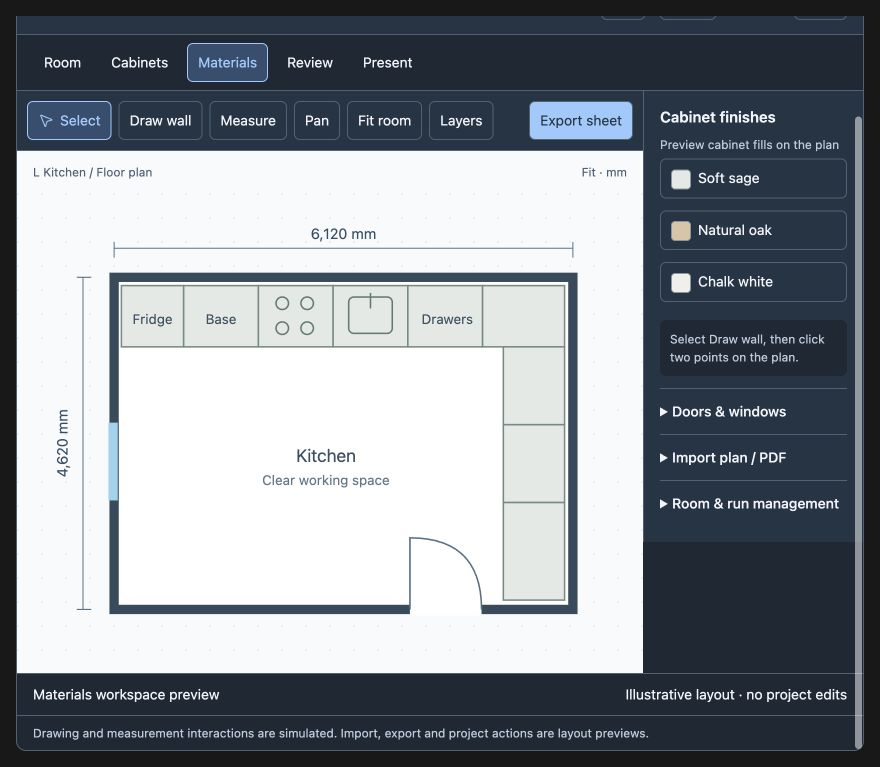

### 10. Draw wall — completed example

Two clicks add a visible wall segment and an illustrative length in the status line. Production must preserve real snapping, topology, dimensions and undo.

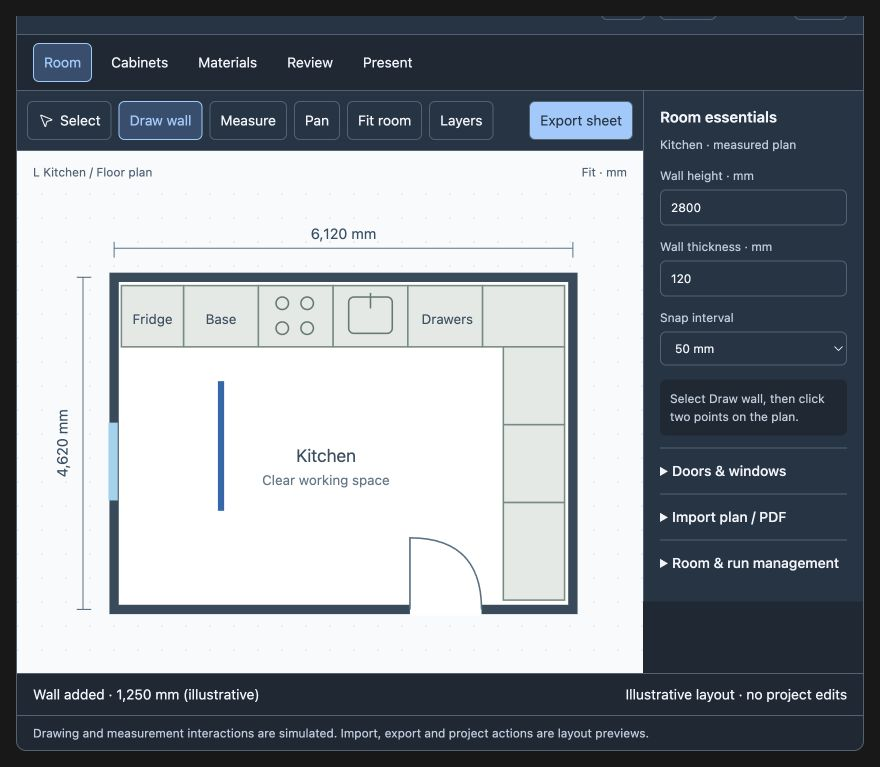

### 11. Measure — completed example

Two clicks add a dimension example. Mockup measurements use illustrative coordinates and are not manufacturing evidence.

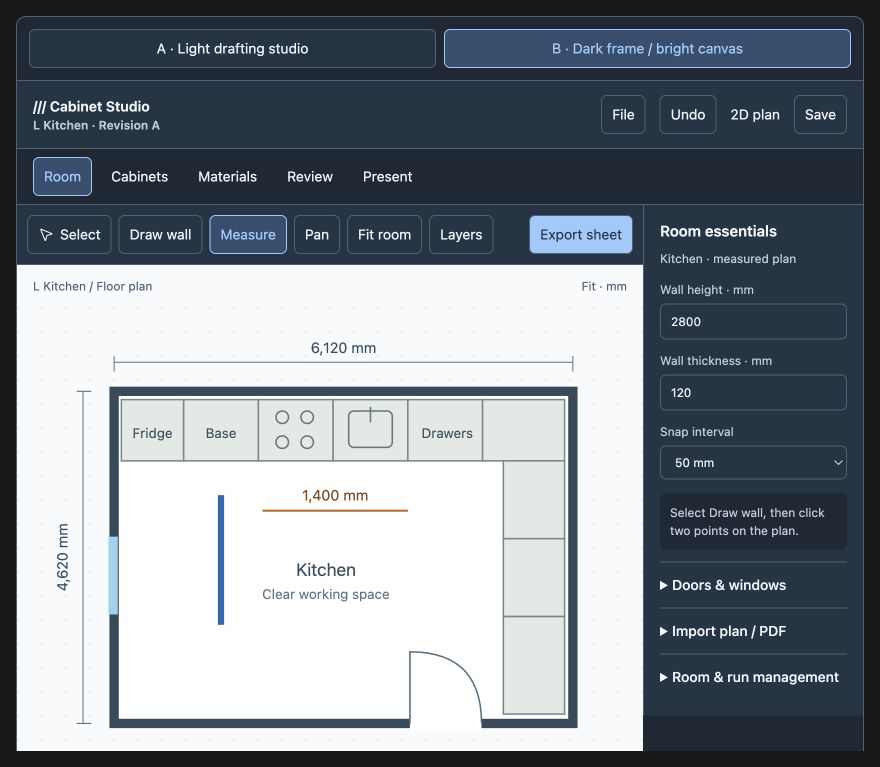

## Problem and intended outcome

The supplied kitchen, bathroom, object-browser, and style-preset screenshots
show pale text on pale toolbar buttons, overlapping or clipped text, excessive
stacked chrome, compressed object cards, an overflowing inspector, obstructed
cabinet views, and unfinished model/material presentation. The target is a
readable, canvas-first workspace with every existing operation still reachable.

The earlier [Interiors chrome reference](INTERIORS_CHROME_MOCKUPS.md) remains
background context. This proposal adds explicit overflow rules and a reviewable
five-area navigation model. Navigation areas are freely selectable, not a
mandatory wizard. Existing product boundaries and release gates still apply.

## Review decisions and implementation boundary

The direction is accepted; the existing concept is not a complete build ticket.
These decisions govern subsequent UI work:

1. Keep Room, Cabinets, Materials, Review and Present as freely accessible areas.
   Remove numbered navigation labels in the next concept revision. Do not use
   step-completion styling or navigation locks; production/approval gates still
   apply to their respective actions.
2. Room opens in 2D with first-class plan authoring. The current concept does
   switch to an illustrative plan, but does not yet represent the full shipped
   measurement, underlay, run and export workflow.
3. The inspector follows selection: room essentials when nothing is selected,
   then wall, opening, cabinet, run or supporting-object controls as appropriate.
   Do not implement the concept's retained cabinet inspector on an empty Room.
4. Include File, Save status, Undo and Redo in the first shared-shell build.
   They are required from day one, not follow-up polish.
5. Client presentation hides editing actions, selection outlines, grids and
   diagnostics. Retain only appropriate presentation navigation; editing camera
   tools remain available after returning to design.

Keep the wrapping-card, essentials/advanced and independent-panel-scroll rules.
Narrow layouts are a fallback, not a commitment to mobile CAD. Detailed quote,
freeze, approval, recovery and export dialogs must be designed before those
surfaces are reorganized. Geometry, costing and manufacturing math are outside
the contrast and shell changes.

Step 1 now provides the inventory and repeatable output evidence. Its proposed
destinations still require per-control runtime verification as tools move; a
static mapping is not proof that a replacement is reachable or correct.

## Complete journey

Projects → create/open/restore job → Room → Cabinets → Materials → Review
→ price → freeze quote → Present/proposal → record approval → engineering
→ production review/export. Return to any design area to revise; existing quote
drift and approval rules determine which downstream states become stale.

### Shared shell

- Header: project/room/revision, file menu, save state, undo/redo, 2D/3D, Present.
- Navigation: unnumbered Room, Cabinets, Materials, Review, Present; preserve selection,
  camera and panel state where appropriate across switches.
- Left panel: tools or library relevant to the active area. Search and category
  selection stay anchored to that library, not scattered across the viewport.
- Canvas: one compact view toolbar; view preset, Orbit/Walkthrough, Fit, Focus.
  FOV, camera height and other advanced camera options live in a popover.
- Right inspector: selected object identity and essentials, then expandable
  sections. A single property has one authoritative editing control.
- Footer: units, snap and actionable issue count. Detailed help is on demand.
- Keyboard shortcuts remain supported, including command access when panels
  are collapsed. Focus must not jump during field edits or panel expansion.

### 0. Projects and recovery

New job, saved jobs, templates, file open/import, autosave recovery, and room
navigation remain available. Opening malformed or older projects must produce
an actionable recovery state rather than a blank screen. Surface save failure,
unsaved changes and restore choices. Do not overwrite recovery data merely to
preview a template. This screen is specified here but not drawn in the concept.

### 1. Room

Default to the measured plan. Left tools expose selection, room/wall drawing,
doors, windows, obstacles, underlay import, measurement and room management.
Selecting a wall shows length, height and thickness; advanced sections retain
node joins/splits, offsets, coordinates and panel attachment. Openings show their
own dimensions, elevation and placement. Existing snap, topology, dimensions,
undo and underlay tools retain their real behavior.

Switching to 3D must preserve room identity. View cutaway is separate from
lowering a wall to a plan trace or changing wall height. Explain the difference
where structural actions are exposed. Empty selection shows room essentials.

#### Required 2D Room reference before the shell build

Revise the concept to show a real plan-oriented screen arrangement with:

- A measured room plan, readable dimensions, clear pan/zoom and Fit affordances.
- Draw/select, Measure, snap controls and image/PDF underlay import, calibration
  and visibility controls, using the currently supported operations.
- Room selection/management and correct empty, wall and opening inspectors.
- Existing cabinet runs visible in plan, with direct access to Cabinets/run
  editing while retaining room and selection context.
- Existing plan drawing-sheet/export actions accessible from the Room workflow.
- The complete header, expanded panels and long labels at laptop widths.

Review this reference against the existing
[2D plan roadmap](2D_PLAN_LAYER_ROADMAP.md) and Step 1 inventory. Do not replace
existing plan functionality with the concept's illustrative SVG. The updated
reference is required before step 3, but does not block step 2's localized
readability and overflow fixes.

### 2. Cabinets and supporting objects

Browse base/wall/tall cabinets, runs, open shelves, fillers, countertops and
supporting objects. Keep search and category filtering. Cards show a preview,
full readable name and dimensions on separate lines. Missing previews use a
labelled fallback; a dimension-only pill is never an acceptable card.

Select a library item → preview placement → place with existing snap/fit rules
→ inspect/resize → duplicate/rotate/delete as needed. Distinguish library
preview from a placed object. Selecting a run exposes run-level alignment,
fillers, countertop and validation operations. Advanced cabinet construction,
composition, openings, materials and production fields remain reachable.

### 3. Materials

Select a surface/object → select its material slot → preview a finish → choose
scope → apply through the existing command/undo system. Current finish and
target slot stay visible. Scope must be explicit: face/slot, object, compatible
run, or another currently supported scope. Do not invent unsupported bulk edits.

Preserve imported finishes, texture options, UV scale/rotation, material slots,
and existing style presets. Full style names wrap; palette strips supplement
names. Applying a preset must disclose its scope and retain undo. Texture load
failure needs an explanation and retry/fallback, not silent substitution.
Validate material assignments all the way to compiled scene and render output.

### 4. Review and quote

Issues are grouped by severity with object identity, plain explanation and
Locate/Fix actions. Focus the affected cabinet and show relevant properties.
Keep unsupported corner adapters visibly actionable. Distinguish cosmetic
preview issues from production-blocking geometry or data problems.

Review price → edit existing commercial fields → see current totals and pricing
source → freeze revision. Preserve costing settings, currency/tax behavior,
quote snapshots and stale-design detection. The UI must not imply approval or
manufacturability from a clean-looking render. Quote details are not implemented
in the concept; its review actions show only their intended navigation entry.

### 5. Present, approval, and engineering

Present uses saved views with editing panels, selection marks, grids and debug
text hidden. Return to design restores context. Preserve camera decks, render
settings, image/PDF exports, branding and proposal generation. Keep technical
quality diagnostics outside the client view without losing access to them.

Record approval against the correct revision using existing approval controls.
Send the same cabinet identities and design revision to engineering. Engineering
retains technical drawings, cutlists, machining/production files, validation,
readiness gates and overrides already supported. Do not force these controls
into the everyday sales canvas. Changes after approval retain existing drift
and readiness rules. The concept has no live approval, pricing or export engine.

## Layout and expansion contract

| Area | Rule | Review case |
| --- | --- | --- |
| Header/view toolbar | Wrap or move secondary commands to labelled menus; never shrink text to fit | Narrow laptop and 200% zoom |
| Desktop columns | Bounded side panels with a flexible canvas; children use min-width: 0 | 1280 and 1440 px |
| Library cards | Content-driven height; preview, name, dimensions are separate rows/columns; no fixed tiny button height | Long shower and refrigerator names |
| Category filters | Wrapping controls or labelled select; retain accessible category names | Kitchen Appliances and Bathroom |
| Inspector | Essentials first; expandable sections grow in normal flow; dedicated panel scrolling in the eventual desktop app | Open every section |
| Style presets | Full-width entries with palette strip and wrapping name | Warm Contemporary fully visible |
| Forms | Labels and units remain visible; fields cannot force parent width; errors wrap below inputs | Large values and validation text |
| Smaller widths | Reflow/collapse side panels before compressing the canvas; retain explicit reopen controls | 850, 736 and 390 px |
| Empty/loading/error | Explain state and next action; reserve stable preview space | No search results, missing texture/model |

The standalone reference intentionally grows vertically for screenshot review.
Its stacked narrow layout is a fallback concept, not a promise of a complete
mobile CAD editor. The production desktop layout needs independently scrollable
panels and a stable canvas, verified with all accordions expanded.

## Functionality preservation map

This is the capability-level migration map. Step 1 adds the
[source inventory, command mappings and preservation baseline](ui-workflow-step1/README.md).
Proposed destinations do not certify runtime reachability; retain existing
entry points until their replacements are verified.

| Existing capability | Intended destination | Preservation check |
| --- | --- | --- |
| Files, recovery, rooms, revisions | Header / Projects | Save/reopen and legacy project recovery |
| Undo/redo and shortcuts | Header + existing keybindings | Reversible placement and material changes |
| Draw/measure/underlay/snap | Room | Existing plan workflow |
| Wall topology/openings/panels | Selection inspector / Advanced | Geometry and opening values unchanged |
| Cabinet library and run authoring | Cabinets library / Run inspector | Identities, run parts and placement retained |
| Rotate/duplicate/delete | Selection action group + shortcuts | Original handlers and history behavior |
| Materials/import/UV/presets | Materials + contextual slot inspector | Correct slot, scope, persistence and render |
| Camera/navigation/cutaways | Canvas toolbar / View settings | Geometry unchanged by view operations |
| Issues, pricing, freeze/revisions | Review | Same totals, fingerprints and drift results |
| Rendering, proposals and approvals | Present / Review | Existing export and approval gates |
| Engineering, drawings, cutlist, machine output | Engineering workbench | Same production data for same document |

### 3D object transform contract

- Selecting one placed object, door, or window in the Perspective view shows a
  conventional red X, green Y, and blue Z move gizmo at its project origin.
- Axis dragging previews the transformed scene and inspector values together,
  snaps with the document snap increment, and commits one existing move/update
  command on pointer release so undo and persistence remain unchanged.
- Cabinets continue through cabinet wall/run placement validation. Doors and
  windows project back onto their host wall, remain inside its clear span, and
  clamp vertically within the wall height.
- The selection inspector keeps Position X/Y/Z beside Size W/H/D. Opening depth
  is stored as an opening parameter and bounded by host-wall depth; changing it
  does not mutate the wall shared by other openings.
- Presentation mode does not render authoring gizmos or selection readouts.

Likely UI entry points to inspect include `ModelViewToolbar.tsx`,
`ContextualCommandRail.tsx`, `LivingRoomInspectorPanel.tsx`,
`CatalogObjectBrowser.tsx`, `ModelViewStylePalette.tsx`, and the Interiors
workspace/header/present components. Component names are starting points, not
permission to bypass domain commands or rewrite project serialization.

## Build sequence and gates

1. **Complete — inventory and baseline:** inventory commands, screens, saved
   data and baseline outputs. [Step 1 evidence](ui-workflow-step1/README.md)
   records preserved destinations, repeatable fixtures and verification limits.
   No existing controls are removed; replacement reachability remains a gate
   for each subsequent UI migration.
2. **Complete — contrast and overflow:** unify Interiors control styling and fix
   contrast/overflow in the existing layout. [Step 2 evidence](ui-workflow-step2/README.md)
   covers Calm/Compact enabled, selected, disabled, focus, error and loading
   states. Handlers and domain math unchanged. Complete the 2D Room reference
   as separate design work before step 3.
3. **Complete — shared shell (tools still in place):** unnumbered free navigation,
   File + Save + Undo/Redo header, inspector essentials/advanced expansion, and
   independent panel scroll. [Step 3 evidence](ui-workflow-step3/README.md).
   The 2D Room reference checklist remains open as parallel design work; this
   shell uses the live plan canvas. Do not relocate tools until step 4.
4. **Complete — area tool/library relocation:** route room/cabinet/material/review
   controls through workflow areas, reusing existing handlers and undo.
   [Step 4 evidence](ui-workflow-step4/README.md).
5. **Complete — camera framing / cutaways / material feedback:** compact 3D
   toolbar with advanced view popover, clarified cutaway vs wall raise/height,
   and Materials apply summary plus texture-fallback notice.
   [Step 5 evidence](ui-workflow-step5/README.md). Domain fit/cutaway/paint math
   unchanged.
6. **Complete — model adapters / assembly / material quality:** surface existing
   fallback, corner-preview, assembly, and GLB/catalog-preview signals in Review
   and the viewport without changing compile or gate math.
   [Step 6 evidence](ui-workflow-step6/README.md).
7. **Complete — Review / Present / engineering journey:** surface existing
   proposal gate rows, client identity, Present client chrome strip, and
   Return-to-Review / Open Present navigation without changing gate math.
   The follow-up now groups commercial controls into progressive Review sections;
   deeper quote-table and approval-dialog visual redesign remains tied to the
   existing commercial domain and needs dedicated acceptance references.
   [Step 7 evidence](ui-workflow-step7/README.md).
8. **Complete — starters / saved projects / golden journey verification:**
   five-area entry-point smoke, Present→Review→cabinet edit path, and
   save/reopen checks. Full golden/manufacturing suites remain the existing
   pointed specs. [Step 8 evidence](ui-workflow-step8/README.md).

Required verification: meaningful existing unit/domain tests, build, relevant
browser workflows, visual comparison of long/expanded states, and before/after
production outputs for identical documents. Add focused tests for new behavior;
do not use screenshot quality as proof of manufacturing correctness.

## Current concept limits and review decisions

- The kitchen is illustrative SVG, not the application's real 3D renderer.
- Selecting a library item changes labels/fields but does not place its model.
- Dimension inputs and scope selection do not mutate geometry or project data.
- Material colors preview cabinet fronts; other surface selections are labels.
- Front elevation, quotation, engineering and export entries are placeholders.
- The header omits some production commands (file/save/undo/redo); the final
  shell must include them as specified above.
- Room currently retains a cabinet inspector in the concept; the implemented
  room screen must use the room/wall/opening contextual inspector.
- The concept's numbered navigation and incomplete 2D toolset predate the review
  decisions above; update the reference before using it for the shared shell.
- Present still includes view controls and a concept message; final client mode
  must remove editing-only elements and selection outlines.

Review the navigation, panel arrangement, card readability and expansion first.
Detailed commercial dialogs and geometry-specific inspectors need a subsequent
design pass before their implementation; screenshots must not be treated as
complete specifications for those unrepresented states.

See the [visual review guide](mockups/workflow-review/README.md) for captures.
