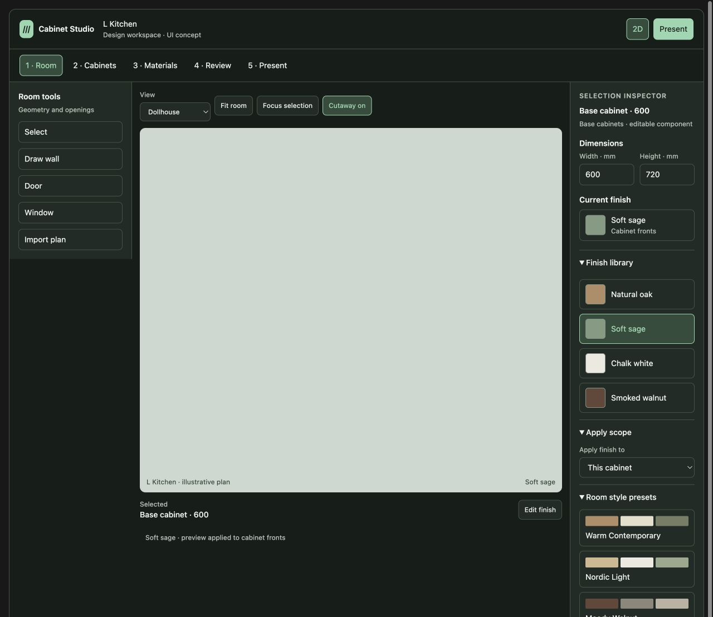
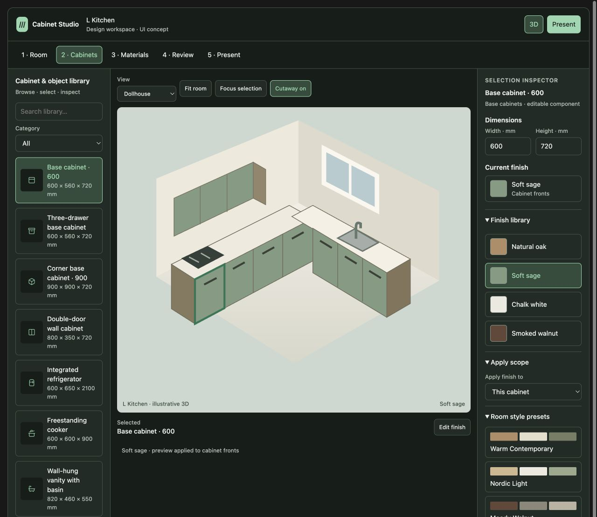
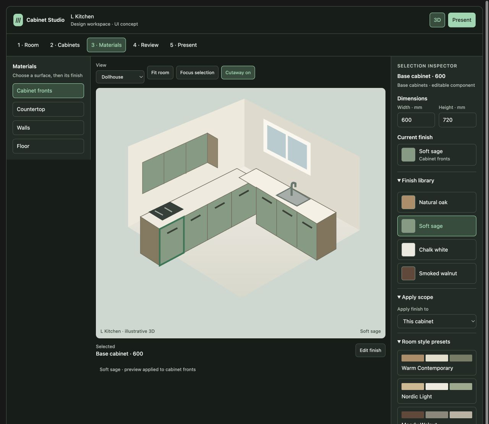
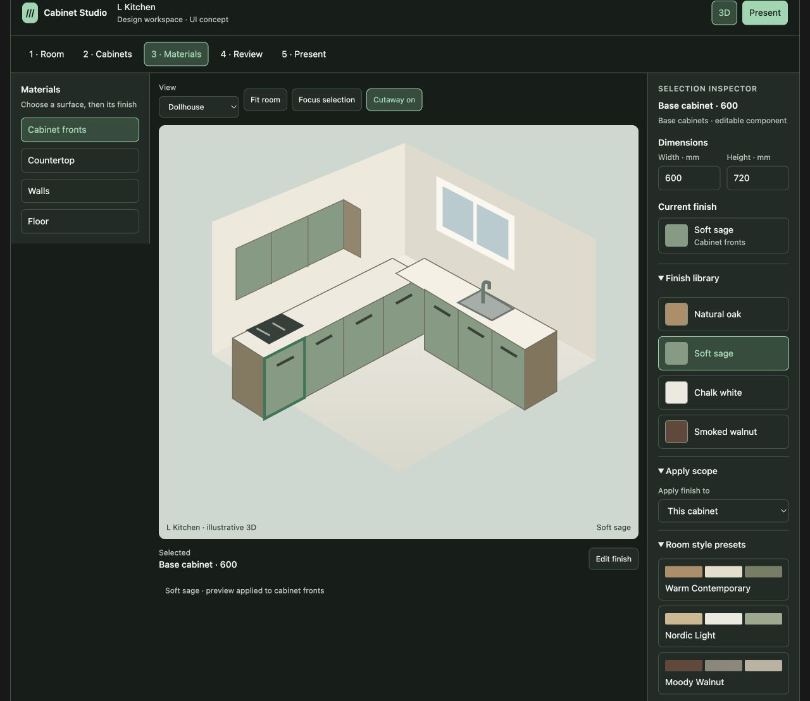
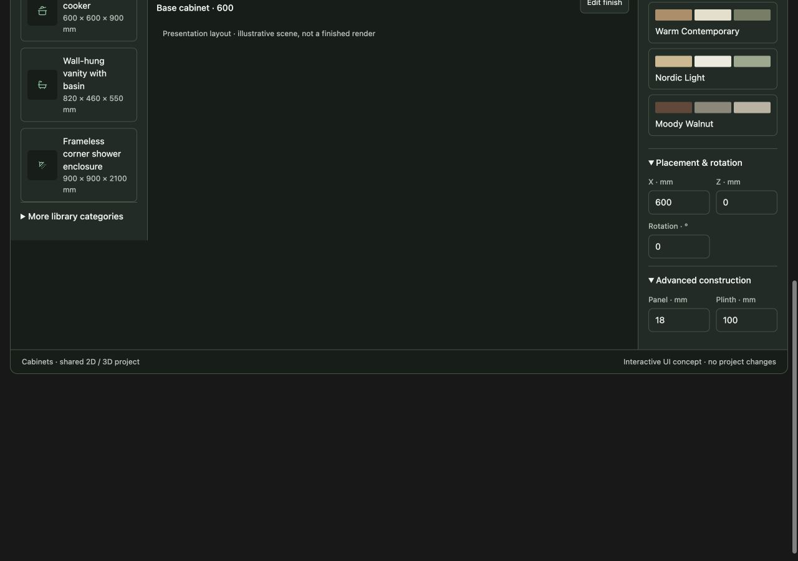
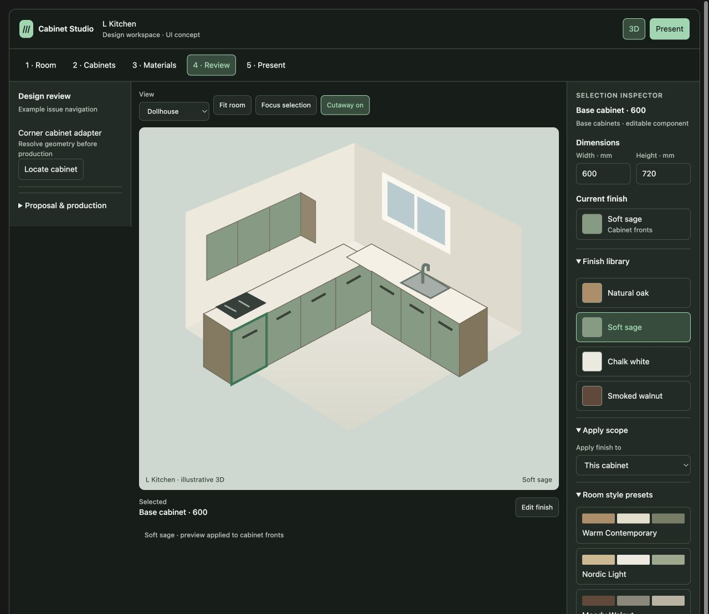
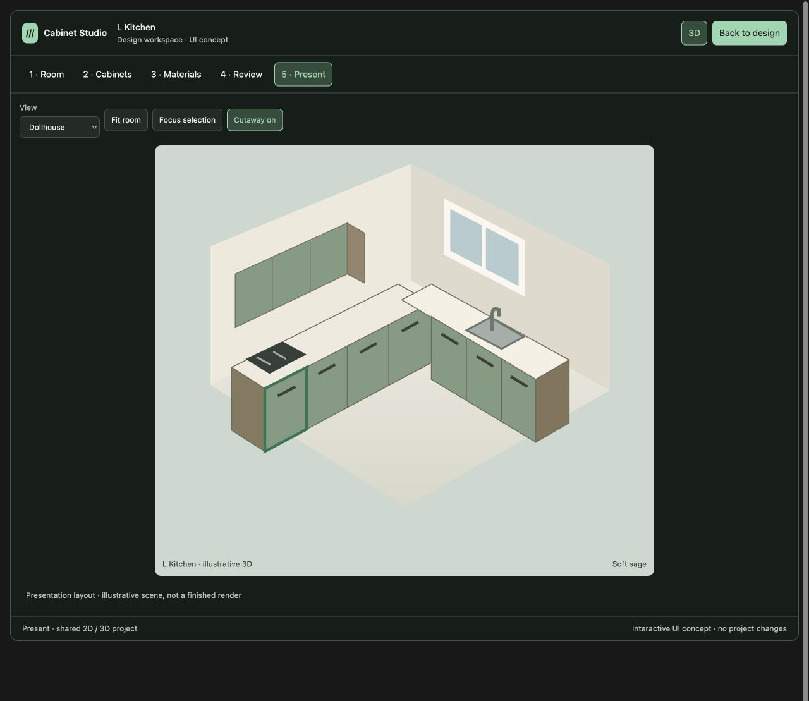
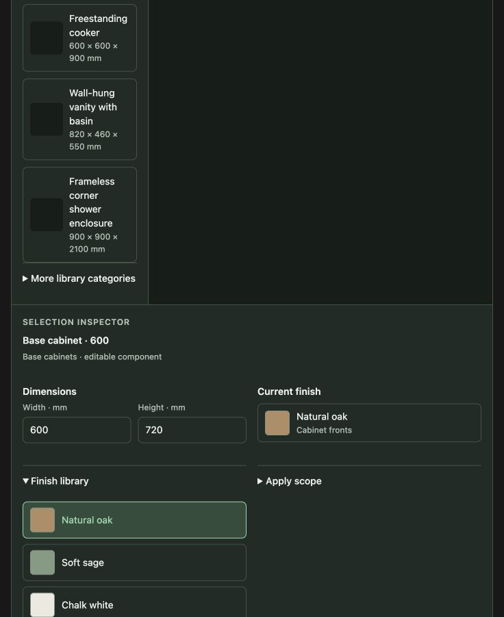
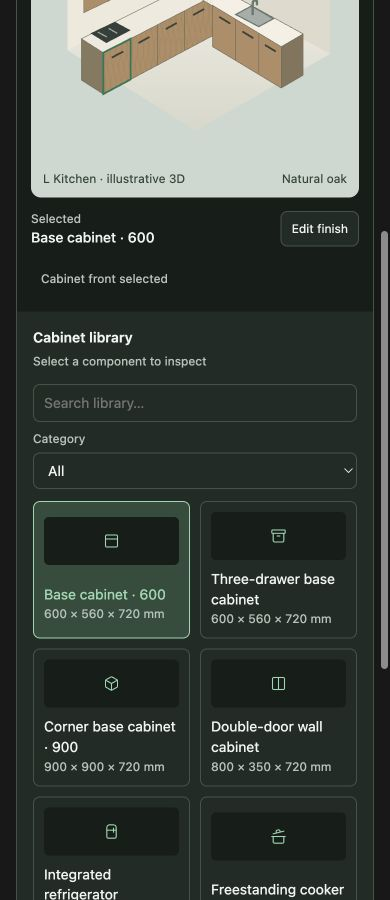

# Workflow visual review

Status: proposed UI reference, not an implemented application. Review with the
[full specification](../../UI_WORKFLOW_REDESIGN.md) before building.

The design direction is accepted, with revisions recorded in the specification.
These screenshots and the interactive concept have not yet been updated to show
the unnumbered navigation, complete header, full 2D Room toolset and contextual
Room inspector. Use them as layout references, not final implementation tickets.

[Open the interactive concept](index.html). This local standalone copy preserves
the sandboxed iframe and CSP from the visualization renderer. Its outer frame
is taller for local review. It has not been published. Open it in a browser;
Markdown renderers may only show its source.

## What to review

Follow Room → Cabinets → Materials → Review → Present, then return to design.
Search for a shower or refrigerator; expand the library categories, material
scope, room presets, placement and advanced construction. Check long names and
dimensions. Select a finish to see the illustrative cabinet fronts change.

The drawing is illustrative and many controls are demonstrations. It is not
evidence of real geometry, material fidelity, quotations or production output.
The specification records these limitations and additional required screens.

## Screenshot guide

Captures show the local concept, not the current production application. Desktop
captures use 1280 CSS px width. Tall panels have a separate lower-panel capture;
these are viewport screenshots, not stitched full-page renderings.

### 1. Room and plan

Review the compact room tools and dominant plan canvas. The final room inspector
must reflect room/wall/opening selection; the concept retains a cabinet inspector.

### 2. Cabinet and object library

Object names and dimensions occupy separate lines. Cards grow with content.
The shower and vanity names continue in the lower-panel capture.

### 3. Material selection and expanded sections

Review target surface, current material, readable swatches and application scope.
Style names use full-width wrapping entries. Lower entries are shown next.

### 4. Lower inspector and long object names

Review complete preset names, placement fields, construction fields and long
object labels. In implementation, the panel will scroll independently while
the canvas remains visible.

### 5. Review

Issues need a clear Locate action. Quote review, engineering and production
entries are navigation placeholders; full commercial forms remain specified in
the workflow document and require a detailed design pass.

### 6. Present

Side panels disappear so the design dominates. Final client mode must also
remove selection marks, editing-only view controls and the concept message.

### 7. Responsive layout

At 736 px the inspector moves below the canvas/library. At 390 px the content
stacks. Both reference widths were checked for root horizontal overflow:
702/702 px and 356/356 px client/scroll width respectively.

## Review checklist before implementation

- [x] Keep five freely accessible areas; remove numbering in the next reference.
- [x] Require File, Save status, Undo and Redo in the first shared-shell build.
- [x] Keep content-driven cards, wrapping names and separate dimension labels.
- [x] Keep selection-specific essentials and expandable advanced settings.
- [x] Keep independent panel scrolling; narrow stacking is a fallback, not mobile CAD.
- [ ] Update and review the first-class 2D Room reference before step 3: drawing,
  measurement, pan/zoom, snap, underlay/PDF, room management, runs and plan export.
- [ ] Detail room, run, opening and empty-selection inspectors.
- [ ] Detail quotation, freeze, approval, save/recovery and export dialogs.
- [x] Complete Step 1 source inventory, proposed destinations and output baselines.
- [x] Complete Step 2 control contrast/overflow CSS in the existing layout
  (Calm/Compact states; handlers unchanged). See
  [Step 2 evidence](../../ui-workflow-step2/README.md).
- [x] Complete Step 3 shared shell: unnumbered free nav, File menu, inspector
  expansion and independent panel scroll. See
  [Step 3 evidence](../../ui-workflow-step3/README.md). Tool relocation is step 4.
- [ ] Verify each replacement entry point at runtime as controls move; retain
  existing entry points until replacements are verified.
- [ ] Update client Present to remove editing chrome and selection marks.
- [x] Keep renderer/geometry acceptance separate from UI layout checks.

- [x] Complete Step 4 area tool/library relocation (handlers unchanged). See
  [Step 4 evidence](../../ui-workflow-step4/README.md).
- [x] Complete Step 5 camera framing, cutaway clarification, and material
  feedback. See [Step 5 evidence](../../ui-workflow-step5/README.md).
- [x] Complete Step 6 model adapters / assembly / material quality feedback
  (gates and compile math unchanged). See
  [Step 6 evidence](../../ui-workflow-step6/README.md).

Next implementation scope: step 7 quotation/freeze/approval/export design, then
Present/engineering navigation with existing gates. Keep completing the 2D Room
reference in parallel.

## Validation performed in this documentation pass

- Opened and switched all five concept stages in the browser.
- Selected a finish and observed the cabinet-front color update.
- Expanded presets, scope, placement and construction sections.
- Captured viewport images including lower-panel content.
- Checked root width versus scroll width at 736 and 390 px.

Application tests were not rerun: this pass changes documentation and static
review assets only. No production UI, domain data or exported output changed.
